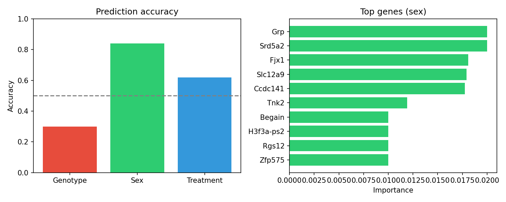

# RNA-seq ML Classifier

A machine learning approach to predict sample phenotypes from gene expression data using Random Forest classification.

## Overview

This project explores whether biological variables (genotype, sex, treatment) can be predicted from RNA-seq gene expression patterns. The analysis compares prediction accuracy across different targets to identify which factors have the strongest transcriptional signatures.

## Results

| Target | CV Accuracy |
|--------|-------------|
| Sex (M vs F) | **80%** |
| Treatment (VEH vs PAC) | 66% |
| Genotype (WT vs Cre) | 42% |

Sex shows the strongest predictive signal, consistent with known chromosomal and hormonal effects on gene expression. Genotype (WT vs Cre) cannot be reliably predicted, suggesting the genetic modification does not produce large-scale transcriptional changes detectable at this sample size.



## Top Predictive Genes (Sex)

| Gene | Importance |
|------|------------|
| Grp | 0.020 |
| Srd5a2 | 0.020 |
| Fjx1 | 0.018 |
| Slc12a9 | 0.018 |
| Ccdc141 | 0.018 |

## Dataset

- 24 mouse samples with balanced factorial design
- ~18,000 genes after filtering (mean count > 10, excluding Gm genes)
- Variables: sex (M/F), genotype (WT/Cre), treatment (VEH/PAC)

## Methods

- **Preprocessing:** Log2(count + 1) normalization, removal of low-expression and unannotated genes
- **Model:** Random Forest (100 trees)
- **Validation:** 5-fold stratified cross-validation

## Usage

```bash
pip install -r requirements.txt
python ml_classifier.py
```

Required input files: `annotation.txt`, `count.txt`

## Output

- `results.png` — accuracy comparison and top predictive genes
- `top_genes.csv` — top 50 genes ranked by feature importance

## Repository Structure

```
├── ml_classifier.py     # Main analysis script
├── annotation.txt       # Sample metadata
├── count.txt           # Gene expression counts (featureCounts output)
├── requirements.txt    # Dependencies
├── results.png         # Output visualization
└── top_genes.csv       # Top predictive genes
```
